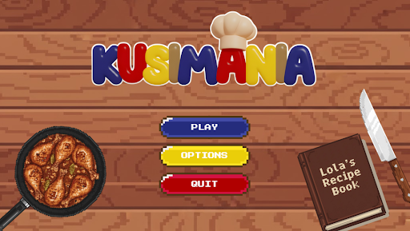
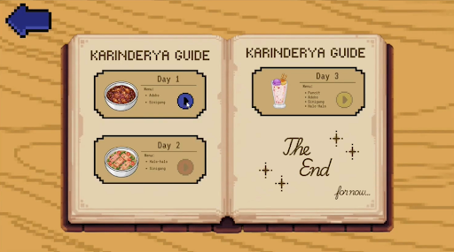
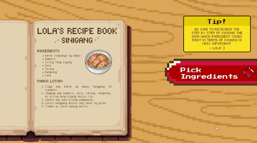
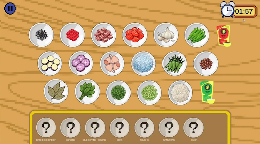
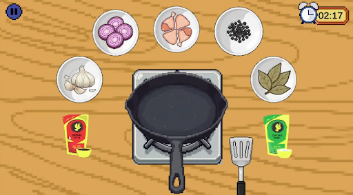
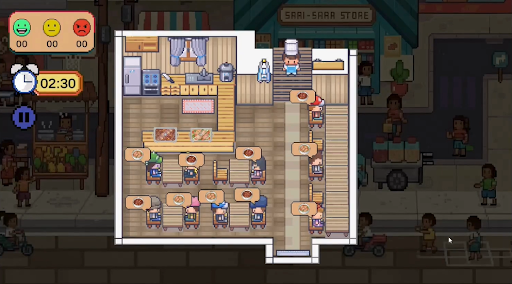

# Kusimania: Lutong Pinoy, Laro ng Bayan

**Final Project for IT 015 – Introduction to Game Development**
**2nd Year, 1st Semester**

## Our Team

- Jonie Aguihap
- John Jeriel Albaran
- Marc Julius Baugbog
- **Abigail B. Dela Cruz** – Lead Programmer and Assistant UI/UX Designer
- Alejah Nichole Gabuan
- Aelous Mathew Marbella

---

## What is Kusimania?

Kusimania is a fun 2D pixel cooking game. You play as **Apo**, a young chef who must run his Lola's (grandma's) small food stall (carinderia) while she is away on a 3-day vacation.

Using Lola's old recipe book, you cook and serve well-loved Filipino dishes like **adobo, sinigang, halo-halo, and pancit** to hungry customers.

---

## Screenshots

---

## Download the Game

The APK file for Kusimania can be found under the **Releases** section of our project repository.

---

## Who Will Play This Game?

**Age Group**
- Main players: age 10 and up (a game for the whole family)
- Also for: young adults and adults who enjoy cute pixel art, relaxing gameplay, and Filipino culture

**Type of Player**
- People who like calm and cozy games
- People who enjoy games where you race against time

---

## Type of Game

- **Main type:** Time management cooking game. You cook fast, take orders, and try to be quick and correct.
- **Also a bit of:** Casual and cultural game. While you cook fast, you also learn about Filipino food and dining traditions.

---

## How the Game is Played

- One player only (single-player)
- No internet needed (offline)
- Has a Challenge Mode – levels get harder as you go
- You see a **first-person view** while cooking
- You see a **top-down view** while serving customers

---

## Game Rules

The game has one loop that repeats, made up of a few simple parts:

**Basic Control:** Click on things to take orders, prepare food, cook, and serve.

**Two Parts of Each Day:**
1. **Cooking Phase** – Pick the right ingredients in the right order to cook a dish.
2. **Serving Phase** – Bring the correct food to the correct customer before time runs out.

**Beat the Clock:** Both phases have a timer, so you must work fast.

**Memory Challenge:** As you level up, ingredient names disappear. You must remember the recipes yourself, just like a real chef.

**Customer Mood and Scoring:**
- Happy (served in 1–35 seconds): full points
- Neutral (served in 36–60 seconds): fewer points
- Angry (took more than 60 seconds): the order fails

**Stars:** Your score turns into a star rating. You need **3 stars** to pass a level and move to the next day.

**Reviews:** After each level, customers leave reviews based on your stars. Good ratings get nice comments, low ratings get more critical comments.

**Daily Goal:** Serve everyone on time and earn enough points for 3 stars.

**Ending:** If you finish every level, you unlock a special ending showing how Apo helped the carinderia succeed.

---

## The Story World

The game happens in a lively Filipino town, centered on Lola's carinderia — known as "the heart of the community." While Lola is away, her grandson Apo takes over. Using her recipe book, Apo works hard to keep the shop's spirit alive.

The whole game is made with charming 2D pixel art that feels nostalgic, like classic retro games, but with a warm Filipino touch.

---

## Screens in the Game

- **Main Menu** – shows the Kusimania logo with Play, Options, and Quit buttons
- **Level Menu** – a recipe book showing Day 1, Day 2, and Day 3
- **Lola's Recipe Book** – shows the ingredients and steps for a dish (example: Sinigang)
- **Cooking Phase** – picking ingredients, then actually cooking the dish
- **Serving Phase** – a top-down view of the carinderia with customers to serve
- **Customer Reviews** – short comments from customers, from 1 star to 3 stars
- **Epilogue Scene** – a short story ending showing Lola's pride in Apo and the carinderia's success
- **Level Status Panels** – shows if a level is Failed, Incomplete, or Complete, along with your stars

---

## Tech Stack

We built Kusimania using **Unity**, with a clean and standard project setup:

- **Engine:** Unity, using the **Universal Render Pipeline (URP)** — a lighter rendering pipeline that still allows nice effects like glow and sparkle, without slowing the game down
- **Scripting Language:** C#
- **Input Handling:** Unity's **New Input System** package — used for our point-and-click controls (picking ingredients, cooking, serving customers). This included custom input actions like `CustomerInputActions` for customer-related interactions.
- **Animation:** Unity's **Animator Controller** system — used for customer sprite animations (walking to tables, reacting with moods)
- **Text/UI:** **TextMeshPro** — used for crisp, clean text in menus, timers, the recipe book, and customer reviews

**Project Folder Structure:**
- `Scripts` – all our C# game logic
- `Sprites` – our pixel art assets
- `Prefabs` – reusable objects like customers, dishes, and UI elements
- `Scenes` – Main Menu, Level Select, Gameplay, etc.
- `Resources` – assets loaded dynamically while the game runs
- `StreamingAssets` – raw bundled files
- `Settings` – URP and quality settings

---

## Conclusion

Kusimania is more than just a cooking game — it celebrates Filipino culture, family, and tradition. Through fun, fast-paced gameplay and charming pixel art, it shows the value of hard work, passion, and the joy of serving others, all while honoring Lola's legacy and sharing Filipino food with the world.
